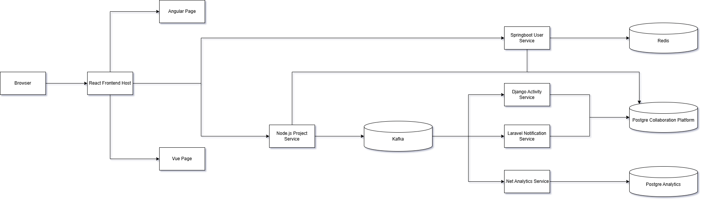
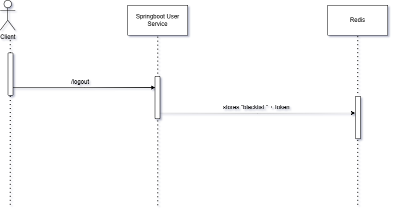
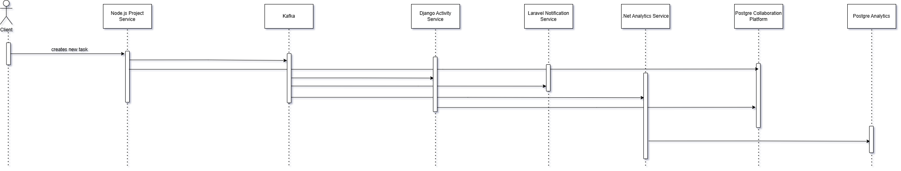

# Full-Stack Microservices Collaboration Platform

A production-style **microservices-based collaboration system** built as a portfolio project to demonstrate **3+ years of software engineering experience** across backend, frontend, distributed systems, and cloud-native architecture.

---

## Overview

This system simulates a real-world **team collaboration platform** where users can:

- Create and manage projects
- Assign and track tasks
- View system activity logs
- Receive simulated notifications (email, SMS, etc.)
- View analytics dashboards

It is built using a **polyglot microservices architecture**, combining multiple backend technologies, event-driven communication, and multiple frontend clients (including microfrontends).

The backends are built with **SOLID principles**, making the system more scalable, maintainable, and readable.

The frontend global state is carefully managed to ensure maintainability across multiple modules and microfrontends.

---

## Tech Stack

### Frontend
- React (Host Application)
- Vue (Microfrontend - Project Module)
- Angular (Microfrontend - Analytics Module)
- TypeScript
- Zustand (State Management)
- Axios

### Backend Services
- Spring Boot (Authentication Service + JWT + RBAC)
- Node.js (Project & Task Service)
- Django (Activity Service)
- Laravel (Notification Service)
- .NET (Analytics Service)

### Communication & Infrastructure
- Kafka (Event Streaming / Async Communication)
- Redis (JWT Blacklist / Token Revocation)
- PostgreSQL (Primary Database)

### DevOps
- Docker
- Docker Compose

---

## System Architecture



---

## Highlighted Flows

### Logout Flow

Logout does not immediately invalidate JWT tokens.

Instead:
- Token is stored in Redis blacklist
- Format: `blacklist:<token>`
- All services validate tokens against Redis before accepting requests



---

### Create Task Flow

- Node.js service handles task creation
- Publishes event to Kafka
- Other services consume events asynchronously



---

## What's Missing?

This project intentionally does not yet include:

- API Gateway
- Single Sign-On (SSO)

The current architecture is designed to remain scalable and extensible, making it possible to integrate both API Gateway and SSO in the future without major architectural changes.

Since authentication is already centralized through the Spring Boot authentication service and JWT-based authorization is shared across services, implementing centralized identity providers or gateway-based routing can be added naturally in the future.

---

## How to Run

### Prerequisites

Make sure you have installed:

- Docker
- Docker Compose

---

### Start All Services

```bash
docker compose up --build